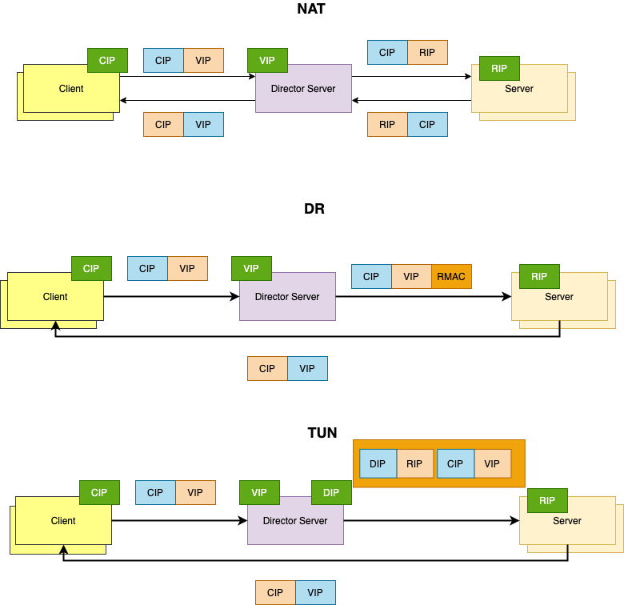
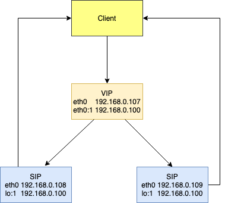

## 网络协议

1. ### ping

   ```shell
   route -n
   Destination     Gateway         Genmask         Flags Metric Ref    Use Iface
   0.0.0.0         172.21.21.1     0.0.0.0         UG    0      0        0 eth0
   169.254.0.0     0.0.0.0         255.255.0.0     U     1002   0        0 eth0
   172.21.21.0     0.0.0.0         255.255.255.0   U     0      0        0 eth0
   ping www.baidu.com
   64 bytes from 110.242.68.3 (110.242.68.3): icmp_seq=1 ttl=251 time=9.16 ms
   #ip 与 Genmask
   #下一跳 172.21.21.1 路由地址
   
   arp -a #链路层mac地址
   ? (169.254.0.23) at fe:ee:ec:79:b4:be [ether] on eth0
   ? (169.254.0.4) at fe:ee:ec:79:b4:be [ether] on eth0
   gateway (172.21.21.1) at fe:ee:ec:79:b4:be [ether] on eth0
   ? (169.254.0.80) at fe:ee:ec:79:b4:be [ether] on eth0
   ? (169.254.128.11) at fe:ee:ec:79:b4:be [ether] on eth0
   ? (169.254.0.79) at fe:ee:ec:79:b4:be [ether] on eth0
   ? (169.254.0.55) at fe:ee:ec:79:b4:be [ether] on eth0
   ? (169.254.0.81) at fe:ee:ec:79:b4:be [ether] on eth0
   ? (169.254.0.2) at fe:ee:ec:79:b4:be [ether] on eth0
   ? (169.254.0.15) at fe:ee:ec:79:b4:be [ether] on eth0
   ? (169.254.0.82) at fe:ee:ec:79:b4:be [ether] on eth0
   ? (169.254.0.3) at fe:ee:ec:79:b4:be [ether] on eth0
   ? (169.254.0.83) at fe:ee:ec:79:b4:be [ether] on eth0
   ? (169.254.128.5) at fe:ee:ec:79:b4:be [ether] on eth0
   
   #arp协议   网关 ff:ff:ff:ff:ff:ff  获取交换机所有mac地址
   
   ```

   

2. ### LVS
   
   
   - #### NAT

     基于三层协议

   - #### DR

     基于二层协议
     
     
     
     node1 192.168.0.107
     
     node2 192.168.0.108
     
     node3 192.168.0.109
     
     node4 192.168.0.110
     
     隐藏IP 192.168.0.100
     
     内核配置

        ```
        #/proc/sys/net/ipv4/conf/eth0
        # arp_ignore   ARP 查询响应
           0 只要本机有此mac地址的网卡，就给予回应。
           1 只有请求的mac地址是自己的网卡，才给予回应。
        # arp_announce 启动通告
           0 发现本机有请求的mac，就会响应
           1 响应匹配的的地址
           2 只响应自己请求的mac地址
        ```
   
     配置

     ```shell
     node2 ,node3
     echo 1 > /proc/sys/net/ipv4/conf/all/arp_ignore
     echo 2 > /proc/sys/net/ipv4/conf/all/arp_announce
     echo 1 > /proc/sys/net/ipv4/conf/eth0/arp_ignore
     echo 2 > /proc/sys/net/ipv4/conf/eth0/arp_announce
     # node1 
     ifconfig eth0:1 192.168.0.100/24
     # node2 
     ifconfig lo:1 192.168.0.100 netmast 255.255.255.255
     # node3 
     ifconfig lo:1 192.168.0.100 netmask 255.255.255.255
     
     #node1 ipvsadm
     yum install ipvsadm -y
     # 入包规则
     ipvsadm -A -t 192.168.0.100:80 -s rr 
     # 出包规则
     ipvsadm -a -t 192.168.0.100:80 -r 192.168.0.108 -g -w 1
     ipvsadm -a -t 192.168.0.100:80 -r 192.168.0.109 -g -w 1
     #node1 keepalived
     yum install keepalived -y
     # 配置地址/etc/keepalived/keepalived.conf
     vrrp_instance VI_1 {
      state MASTER # BACKUP
         interface eth0
         virtual_router_id 51
         priority 100
         advert_int 1
         authentication {
             auth_type PASS
             auth_pass 1111
         }
         virtual_ipaddress {
            192.168.0.100/24 dev eth0 lable etho:1
         }
     }
     virtual_server 192.168.0.100 80 {
         delay_loop 6
         lb_algo rr
         lb_kind DR
         persistence_timeout 50
         protocol TCP
     
         real_server 192.168.0.108 80 {
             weight 1
             HTTP_GET {
                 url {
                   path /
                   status_code 200
                 }
                 connect_timeout 3
                 nb_get_retry 3
                 delay_before_retry 3
             }
         }
       
          real_server 192.168.0.109 80 {
             weight 1
             HTTP_GET {
                 url {
                   path /
                   status_code 200
                 }
                 connect_timeout 3
                 nb_get_retry 3
                 delay_before_retry 3
             }
         }
     }
     #服务启动
     service keepalived start
     ```

   - #### TUN隧道
   
      ```
     跨网络 网络穿透
     ```
   
     

3. 

